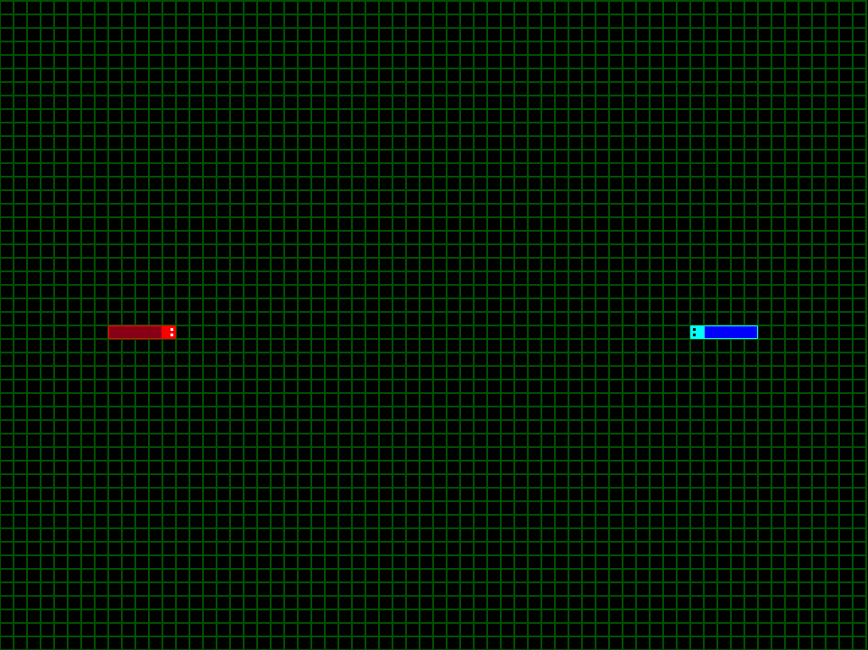

# PyTron
======

A pygame project based on the lightcycle games for Tron. While it is mostly working, I am working on developing extremely good AI.

While the game is relatively efficient and fast, I am also looking for ways to make it increasingly faster. 

## Implementation 

Currently the board is represented by a strongly connected undirected graph using a dict data structure. 
Each coordinate is represented by a tuple as a key in the dict. 
And each coordinate key points to a list of tuples of the coordinates it is next to.
Every time a block of the driver's tail is created, that key and its neighbors who contain that key's value, are removed from the dict.
If a driver hits a coordinate not in the dict, then it crashed and the game resets. 

## AI

My favorite. Currently this is how the AI works. There are a few steps. Because the graph is represented using a dict, 
getting a coord at any given time is constant time. Knowing this, every step of the way the AI driver checks each direction 
using a flood fill algorithm. So if it's going right, it gets the coordinate to the top, right, and bottom. It then adds them all 
and their neighbors to a counter. It then returns the counter. It finds which side has the largest number of free blocks, and goes that way. 

The first AI iteration had the driver essentially emit a line in front of them and to both sides. 

This 2nd AI iteration basically takes the distance apart that the user driver is from the enemy driver, cuts that in half, and then calculates every possible move that the driver can make within that half distance. The enemy driver then runs its floodfill against the graph as if those possible moves were walls. 

## TODO
======

1. Actually implement score
2. Have AI work with multiple AI drivers instead of just the user
3. Delete the driver's tail on death to facilitate a multi driver game instead of just restart
4. Have AI maximize cling to walls when it knows that the user driver is not in its enclosure
5. Implement the Minimax algorithm

### Working Examples of AI Iterations

It shows what it avoids in the first run and how well it does it, but it also shows how you can trick it and what I need to fix in the second run. 

AI1

